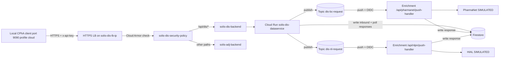

# Prod Setup Runbook

End-to-end, copy-paste runbook for bringing up the Solis NL/BC pipeline in production.

> **Scope**
> - **Project**: reuse `solis-public` (no project creation).
> - **Front door**: HTTPS-only on port 443. Self-signed self-managed SSL cert (`solis-dis-and-adj-cert`) bound to the LB IP via SAN, on a target-https-proxy. Port 80 is intentionally not exposed at the LB (no forwarding rule). The single cert covers both DIS and ADJ backends because both sit behind the same URL map.
> - **HIAL (NL) / PharmaNet (BC)**: both remain `SIMULATED` in prod. No HIAL credentials / VPC connector in this runbook - see the appendix for flipping later.
> - **Region**: `northamerica-northeast1`.

## Services at a glance

| Service | Runtime | Port / URL | Profile | Needs from GCP |
|---|---|---|---|---|
| **CPhA client** (`solis-adj-cphaClientService`) | Local JVM | `http://localhost:9090` (profile `cloud`) | `cloud` | Secret Manager (`sm://solis-dis-gateway-api-key`), ADC |
| **Dataservice** (`solis-dis-dataservice`) | Cloud Run | `https://solis-dis-dataservice-<hash>.run.app` | default | Pub/Sub publisher, Firestore read/write |
| **Enrichment** (`solis-dis-enrichmentservice`) | Cloud Run | `https://solis-dis-enrichmentservice-<hash>.run.app` | default | Pub/Sub push target (JWT), Firestore write, `hial.endpoint=SIMULATED` |

## End-to-end architecture



---

## Step 1 - Local workstation pre-reqs

Install and authenticate once per operator workstation.

- `gcloud` CLI installed.
- Java 21 + Maven 3.9 available on `PATH`.
- Operator IAM roles on `solis-public`: `roles/run.admin`, `roles/pubsub.admin`, `roles/secretmanager.admin`, `roles/compute.loadBalancerAdmin`, `roles/compute.securityAdmin`, `roles/iam.serviceAccountAdmin`, `roles/iam.serviceAccountUser`, `roles/artifactregistry.admin`, `roles/datastore.owner`.

```bash
# Log in as a human user (needed for gcloud commands below).
gcloud auth login

# Log in as Application Default Credentials - required so the local CPhA client can
# resolve sm://solis-dis-gateway-api-key from Secret Manager at startup.
gcloud auth application-default login

# Pin project + default Cloud Run region so we don't have to pass --project / --region everywhere.
gcloud config set project solis-public
gcloud config set run/region northamerica-northeast1
```

---

## Step 2 - Enable APIs and create Artifact Registry repo

One-time per project. Each API is explained inline.

```bash
# Cloud Run - hosts dataservice and enrichment.
gcloud services enable run.googleapis.com

# Cloud Build - used by deploy.sh to build container images server-side.
gcloud services enable cloudbuild.googleapis.com

# Artifact Registry - stores the built images that Cloud Run pulls at deploy time.
gcloud services enable artifactregistry.googleapis.com

# Pub/Sub - async channel between dataservice (publisher) and enrichment (push subscriber).
gcloud services enable pubsub.googleapis.com

# Firestore - persists inbound requests (dataservice writes) and responses (enrichment writes).
gcloud services enable firestore.googleapis.com

# Secret Manager - stores the gateway x-api-key the CPhA client sends to the LB.
gcloud services enable secretmanager.googleapis.com

# Compute Engine API - required for the external HTTPS LB, NEGs, Cloud Armor.
gcloud services enable compute.googleapis.com

# IAM API - needed for programmatic service account management.
gcloud services enable iam.googleapis.com

# Create the Artifact Registry Docker repo that both deploy.sh scripts push images to.
# Needed by: dataservice + enrichment (source of container images).
gcloud artifacts repositories create solis-dis-messages \
  --repository-format=docker \
  --location=northamerica-northeast1
```

---

## Step 3 - Runtime service accounts + IAM

Three SAs, each scoped to least privilege.

```bash
# Dataservice runtime SA - publishes to Pub/Sub topics and reads/writes Firestore.
gcloud iam service-accounts create solis-dis-dataservice-sa \
  --display-name="solis-dis-dataservice runtime"

# Enrichment runtime SA - writes Firestore only (push traffic is inbound, not outbound).
gcloud iam service-accounts create solis-dis-enrichment-sa \
  --display-name="solis-dis-enrichmentservice runtime"

# Pub/Sub push identity - the SA Pub/Sub uses to sign OIDC tokens delivered to enrichment.
# The enrichment service's SecurityConfig validates the JWT's email claim == this SA.
gcloud iam service-accounts create pubsub-push \
  --display-name="Pub/Sub push OIDC identity"

# Grant Firestore access to both runtime SAs (datastore.user is write+read on Firestore Native).
gcloud projects add-iam-policy-binding solis-public \
  --member="serviceAccount:solis-dis-dataservice-sa@solis-public.iam.gserviceaccount.com" \
  --role="roles/datastore.user"
gcloud projects add-iam-policy-binding solis-public \
  --member="serviceAccount:solis-dis-enrichment-sa@solis-public.iam.gserviceaccount.com" \
  --role="roles/datastore.user"

# Allow the Pub/Sub service agent to mint OIDC tokens on behalf of the pubsub-push SA.
# Without this binding every push delivery fails to produce a JWT and enrichment never gets hit.
PROJECT_NUMBER=$(gcloud projects describe solis-public --format='value(projectNumber)')
gcloud iam service-accounts add-iam-policy-binding \
  pubsub-push@solis-public.iam.gserviceaccount.com \
  --member="serviceAccount:service-${PROJECT_NUMBER}@gcp-sa-pubsub.iam.gserviceaccount.com" \
  --role="roles/iam.serviceAccountTokenCreator"
```

---

## Step 4 - Firestore

```bash
# One-time: create Firestore in Native mode in the same region as Cloud Run.
# Needed by: dataservice (inbound writes + response polling) and enrichment (response writes).
gcloud firestore databases create --location=northamerica-northeast1
```

Collections used (all auto-created on first write, listed here for awareness):

- `dis-bc-inbound-requests` - dataservice writes on BC `/api/dis/bc/publish`.
- `dis-nl-inbound-requests` - dataservice writes on NL `/api/dis/nl/publish`.
- `dis-bc-responses` - enrichment writes after PharmaNet (SIMULATED) reply; dataservice polls.
- `dis-nl-responses` - enrichment writes after NL HIAL (SIMULATED) reply; dataservice polls.

---

## Step 5 - Secret Manager (gateway API key)

```bash
# Generate a strong API key - keep a copy to supply to any external caller of the LB.
API_KEY=$(openssl rand -hex 32)

# Create the secret. Consumed by:
#   - CPhA client via spring.config.import=sm:// and gateway.api-key=${sm://solis-dis-gateway-api-key}
#   - clb-setup (Step 10) to embed into the Cloud Armor allow rule expression
echo -n "${API_KEY}" | gcloud secrets create solis-dis-gateway-api-key --data-file=-

# Grant the operator (running the local CPhA client via ADC) permission to read the secret.
gcloud secrets add-iam-policy-binding solis-dis-gateway-api-key \
  --member="user:$(gcloud config get-value account)" \
  --role="roles/secretmanager.secretAccessor"
```

---

## Step 6 - Pub/Sub topics

```bash
# BC topic - published by dataservice; pushed to enrichment /api/pharmanet/push-handler.
gcloud pubsub topics create dis-bc-request

# NL topic - published by dataservice; pushed to enrichment /api/nlpn/push-handler.
gcloud pubsub topics create dis-nl-request

# Grant publisher role to the dataservice runtime SA on both topics.
for T in dis-bc-request dis-nl-request; do
  gcloud pubsub topics add-iam-policy-binding "${T}" \
    --member="serviceAccount:solis-dis-dataservice-sa@solis-public.iam.gserviceaccount.com" \
    --role="roles/pubsub.publisher"
done
```

> Push **subscriptions** are created in Step 9 (after enrichment is deployed and its URL is known).

---

## Step 7 - Deploy dataservice

```bash
# Run the repo's deploy.sh as-is: mvn clean package, upload via Cloud Shell, Cloud Build image,
# gcloud run deploy. The script pushes to northamerica-northeast1-docker.pkg.dev/solis-public/
# solis-dis-messages/solis-dis-dataservice:latest.
cd ../solis-dis-dataservice && ./deploy.sh

# --- Prod hardening (not yet in deploy.sh) ---

# Pin runtime SA + lock down ingress. internal-and-cloud-load-balancing means only traffic
# coming through the LB or from internal sources can reach this Cloud Run; direct .run.app
# URL hits from the internet are blocked.
gcloud run services update solis-dis-dataservice \
  --region=northamerica-northeast1 \
  --service-account=solis-dis-dataservice-sa@solis-public.iam.gserviceaccount.com \
  --ingress=internal-and-cloud-load-balancing
```

---

## Step 8 - Deploy enrichment

```bash
# deploy.sh sets two env vars that drive SecurityConfig JWT validation:
#   PUBSUB_PUSH_AUDIENCE -> AudienceValidator: rejects tokens whose aud != this URL
#   PUBSUB_PUSH_SA       -> EmailClaimValidator: rejects tokens whose email != this SA
# Together they ensure only Pub/Sub push with the matching SA + target URL is accepted.
cd ../solis-dis-enrichmentservice && ./deploy.sh

# --- Prod hardening (pin runtime SA; keep ingress=all because Pub/Sub push is a public caller) ---
gcloud run services update solis-dis-enrichmentservice \
  --region=northamerica-northeast1 \
  --service-account=solis-dis-enrichment-sa@solis-public.iam.gserviceaccount.com
```

`hial.endpoint` and `pharmanet.endpoint` stay `SIMULATED` by default. See the appendix for flipping to real endpoints.

---

## Step 9 - Pub/Sub push subscriptions

```bash
# Capture the enrichment Cloud Run URL (must equal CLOUD_RUN_URL in enrichmentservice/deploy.sh
# for the JWT audience check to pass end-to-end).
ENRICH_URL=$(gcloud run services describe solis-dis-enrichmentservice \
  --region=northamerica-northeast1 --format='value(status.url)')

# Grant the pubsub-push SA permission to invoke enrichment. Required because Cloud Run
# enforces run.invoker on every caller identity.
gcloud run services add-iam-policy-binding solis-dis-enrichmentservice \
  --region=northamerica-northeast1 \
  --member="serviceAccount:pubsub-push@solis-public.iam.gserviceaccount.com" \
  --role="roles/run.invoker"

# BC push subscription - delivers dis-bc-request to /api/pharmanet/push-handler.
# push-auth-token-audience MUST equal PUBSUB_PUSH_AUDIENCE in enrichment (= ENRICH_URL),
# otherwise the JWT AudienceValidator returns 401 on every push.
gcloud pubsub subscriptions create dis-bc-request-sub \
  --topic=dis-bc-request \
  --push-endpoint="${ENRICH_URL}/api/pharmanet/push-handler" \
  --push-auth-service-account=pubsub-push@solis-public.iam.gserviceaccount.com \
  --push-auth-token-audience="${ENRICH_URL}" \
  --ack-deadline=60 \
  --message-retention-duration=7d

# NL push subscription - same wiring, different endpoint.
gcloud pubsub subscriptions create dis-nl-request-sub \
  --topic=dis-nl-request \
  --push-endpoint="${ENRICH_URL}/api/nlpn/push-handler" \
  --push-auth-service-account=pubsub-push@solis-public.iam.gserviceaccount.com \
  --push-auth-token-audience="${ENRICH_URL}" \
  --ack-deadline=60 \
  --message-retention-duration=7d
```

---

## Step 10 - External HTTPS load balancer

The idempotent [clb-setup.sh](clb-setup.sh) script at the repo root now bootstraps the whole LB (NEGs, backends, Cloud Armor, URL map, SSL cert, target-https-proxy, 443 forwarding rule). Port 80 is intentionally not exposed - any `http://` caller gets connection-refused at L4.

One cert (`solis-dis-and-adj-cert`) is shared by both backends because they sit behind the same URL map on the same LB IP: `/api/dis/*` -> `solis-dis-backend`, everything else -> `solis-adj-backend`.

### 10a. Generate the self-signed cert (once per LB IP)

```bash
# Capture the LB IP - this is embedded in the cert as a SAN so TLS is valid
# when the client connects directly to the IP (no domain required).
LB_IP=$(gcloud compute addresses describe solis-dis-lb-ip --global --format='value(address)')

# 825 days is the macOS / modern-browser maximum for end-entity certs.
openssl req -x509 -nodes -newkey rsa:2048 -days 825 \
  -keyout solis-dis-and-adj-key.pem -out solis-dis-and-adj-cert.pem \
  -subj "/CN=${LB_IP}/O=Solis/OU=DIS-and-ADJ" \
  -addext "subjectAltName=IP:${LB_IP}"
```

### 10b. Run clb-setup.sh

```bash
# Reserve the LB IP before the first run (one-time).
gcloud compute addresses create solis-dis-lb-ip --global

# The script creates (or skips, idempotently): NEGs, backend services, Cloud Armor
# policy with the x-api-key allow rule, URL map, SSL cert upload, target-https-proxy,
# and 443 forwarding rule. Requires solis-dis-and-adj-cert.pem / solis-dis-and-adj-key.pem
# to be in the working directory the first time (to create the SSL cert).
./clb-setup.sh

# The private key lives in GCP now; remove the local copy so it can't leak.
shred -u solis-dis-and-adj-key.pem
# Keep solis-dis-and-adj-cert.pem around - it's public and needed for the truststore import below.
```

### 10c. Trust the self-signed cert in the local JVM (once per operator workstation)

The client is wired to pick up a project-local trust store automatically via [TrustStoreEnvironmentPostProcessor.java](src/main/java/com/solis/adj/client/config/TrustStoreEnvironmentPostProcessor.java); the default path is `~/.solis/solis-truststore.jks`. Build that store once:

```bash
# 1. Copy the JDK's default cacerts so we keep trusting Google APIs (Secret Manager etc.)
#    alongside our self-signed LB cert.
cp "$JAVA_HOME/lib/security/cacerts" solis-truststore.jks
chmod 644 solis-truststore.jks

# 2. Add the LB cert. Default stock-JDK password is "changeit".
keytool -importcert -noprompt -trustcacerts \
  -alias solis-dis-and-adj-lb \
  -file solis-dis-and-adj-cert.pem \
  -keystore solis-truststore.jks \
  -storepass changeit

# 3. Drop it where the post-processor expects it.
mkdir -p ~/.solis
mv solis-truststore.jks ~/.solis/solis-truststore.jks
```

Overrides (optional):

- `SOLIS_TRUSTSTORE_PATH=/absolute/path/to/store.jks` - put the store somewhere else.
- `SOLIS_TRUSTSTORE_PASSWORD=<pwd>` - non-default password.

When the client starts it logs `Applied javax.net.ssl.trustStore=...` on success, or `gateway.ssl.trust-store=... not found - skipping trustStore system property` if the file is missing (non-fatal, only the LB call will then fail with PKIX).

### 10d. (Future) swap self-signed for a managed cert

When you get a domain:

```bash
# Point DNS A record of <yourdomain> at ${LB_IP}.
gcloud compute ssl-certificates create solis-dis-and-adj-cert-managed \
  --domains=<yourdomain> --global
gcloud compute target-https-proxies update solis-dis-https-proxy \
  --ssl-certificates=solis-dis-and-adj-cert-managed
# Wait for the managed cert to reach ACTIVE, then:
gcloud compute ssl-certificates delete solis-dis-and-adj-cert --global
```

No client truststore change is needed once the cert is issued by a public CA.

---

## Step 11 - Launch the local CPhA client against prod

```bash
# Point the client's cloud profile at the LB IP. application-cloud.properties already uses
# https://${GATEWAY_HOST}, so we only need to export the host.
export GATEWAY_HOST=${LB_IP}

# Preconditions (already done in earlier steps):
#   - Step 5 granted you secretAccessor on solis-dis-gateway-api-key.
#   - Step 1 ran `gcloud auth application-default login`.
#   - Step 10c placed solis-truststore.jks at ~/.solis/ (picked up automatically).

cd ../solis-adj-cphaClientService
mvn spring-boot:run -Dspring-boot.run.profiles=cloud
# Open http://localhost:9090 (the client UI itself is plain HTTP on localhost; only the
# client -> LB leg is HTTPS). The home page should show the current BC / NL badge counts.
```

---

## Step 12 - Smoke tests

```bash
# 0. Port 80 must be closed (no forwarding rule). Expect "Empty reply" / connection-refused:
curl -i "http://${LB_IP}/api/dis/nl/publish" || true

# 1. Cloud Armor rejects missing key with 403. Pass -k because our cert is self-signed.
#    (If you chose to import the cert into the system trust store, drop -k.)
curl -k -i "https://${LB_IP}/api/dis/nl/publish"

# 2. LB forwards to dataservice on valid key. Body content is a placeholder - the point
#    is to confirm 4xx from the dataservice itself, not 403 from Cloud Armor.
API_KEY=$(gcloud secrets versions access latest --secret=solis-dis-gateway-api-key)
curl -k -i -H "x-api-key: ${API_KEY}" "https://${LB_IP}/api/dis/nl/publish" \
  -H "Content-Type: application/json" -d '{"Header":{"interactionId":"COMT_IN300001CA"}}'

# 3. From the client UI: submit one NL message (e.g. /nl-add-patient-note) and one BC message.
#    Both should complete end-to-end, with a CeRx XML response rendered in the browser.

# 4. Verify enrichment received the push (interactionId-specific log line).
gcloud logging read \
  'resource.type="cloud_run_revision" AND resource.labels.service_name="solis-dis-enrichmentservice" AND textPayload:"Building NLPN CeRx message"' \
  --limit=5 --freshness=5m --format='value(timestamp,textPayload)'

# 5. Verify dataservice saw the response in Firestore.
gcloud logging read \
  'resource.type="cloud_run_revision" AND resource.labels.service_name="solis-dis-dataservice" AND textPayload:"dis-nl-responses"' \
  --limit=5 --freshness=5m --format='value(timestamp,textPayload)'
```

---

## Appendix A - Troubleshooting

| Symptom | Likely cause | Fix |
|---|---|---|
| `401 Unauthorized` on `/api/pharmanet/push-handler` or `/api/nlpn/push-handler` | Push subscription `--push-auth-token-audience` != enrichment `PUBSUB_PUSH_AUDIENCE`, OR `--push-auth-service-account` email != enrichment `PUBSUB_PUSH_SA` | `gcloud pubsub subscriptions update <sub> --push-auth-token-audience=$(gcloud run services describe solis-dis-enrichmentservice --region=${REGION} --format='value(status.url)')` |
| `403` at the LB on every request | Cloud Armor default deny - `x-api-key` header missing or not matching the secret | Re-sync: `curl -H "x-api-key: $(gcloud secrets versions access latest --secret=solis-dis-gateway-api-key)" ...` |
| `PERMISSION_DENIED` on Firestore in dataservice or enrichment logs | Runtime SA missing `roles/datastore.user`, or deploy still using default compute SA | Re-run the `gcloud projects add-iam-policy-binding` for the SA + re-apply `--service-account=` to the Cloud Run service |
| `PKIX path building failed` / `javax.net.ssl.SSLHandshakeException` in CPhA client | JVM truststore has no entry for the self-signed cert | Re-run Step 10c `keytool -importcert` (or restart client with `-Djavax.net.ssl.trustStore=` pointing at a store that contains `solis-dis-and-adj-cert.pem`) |
| `curl: (60) SSL certificate problem: self signed certificate` | curl doesn't trust the self-signed cert | Pass `-k` for local testing, or `--cacert solis-dis-and-adj-cert.pem` for a properly verified handshake |
| `curl: (7) Failed to connect ... port 80: Connection refused` | Expected - port 80 is intentionally closed at the LB | Use `https://${LB_IP}` instead |
| Pub/Sub delivering but enrichment never logs a push | Missing `roles/run.invoker` on `pubsub-push@` for the enrichment service | `gcloud run services add-iam-policy-binding solis-dis-enrichmentservice --region=${REGION} --member=... --role=roles/run.invoker` |
| CPhA client log: `Gateway API key loaded from Secret Manager:` is blank | Operator lost ADC or secretAccessor role | `gcloud auth application-default login` + re-check Step 5 IAM binding |

## Appendix B - Flipping HIAL / PharmaNet from SIMULATED to real (future)

When real endpoints are ready:

```bash
# 1. Store credentials in Secret Manager (one secret per endpoint).
echo -n "<hial-token>" | gcloud secrets create nl-hial-token --data-file=-
echo -n "<pnet-token>" | gcloud secrets create bc-pharmanet-token --data-file=-

# 2. Grant the enrichment runtime SA access.
for S in nl-hial-token bc-pharmanet-token; do
  gcloud secrets add-iam-policy-binding "${S}" \
    --member="serviceAccount:solis-dis-enrichment-sa@solis-public.iam.gserviceaccount.com" \
    --role="roles/secretmanager.secretAccessor"
done

# 3. Point enrichment at the real endpoints. This overrides the defaults baked into application.properties.
gcloud run services update solis-dis-enrichmentservice \
  --region=northamerica-northeast1 \
  --update-env-vars="hial.endpoint=https://hial.gov.nl.ca/api/cerx,pharmanet.endpoint=https://pharmanet.gov.bc.ca/api/hl7"

# 4. If either endpoint is on a private network, attach a Serverless VPC Access connector:
#    gcloud run services update solis-dis-enrichmentservice --vpc-connector=<connector>.
```

## Appendix C - One-glance first-time bootstrap order

1. Step 1 - workstation pre-reqs
2. Step 2 - APIs + Artifact Registry
3. Step 3 - service accounts + IAM
4. Step 4 - Firestore
5. Step 5 - Secret Manager
6. Step 6 - Pub/Sub topics
7. Step 7 - deploy dataservice
8. Step 8 - deploy enrichment (captures `CLOUD_RUN_URL` for Step 9 audience)
9. Step 9 - Pub/Sub push subscriptions
10. Step 10 - HTTPS LB + Cloud Armor
11. Step 11 - launch local CPhA client
12. Step 12 - smoke tests

Tear-down is the reverse order (delete forwarding rules + proxies + cert first, then backend services / URL map / security policy / NEGs, then subscriptions, then topics, then Cloud Run services, then SAs).
